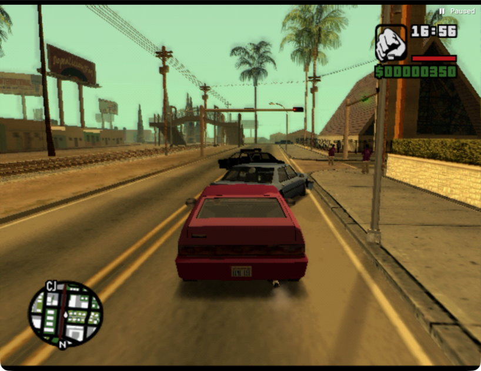
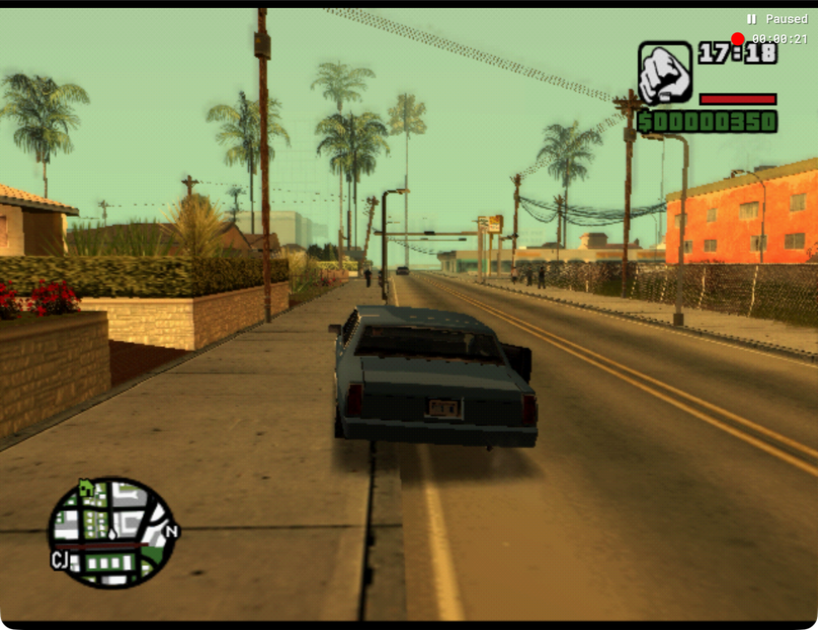
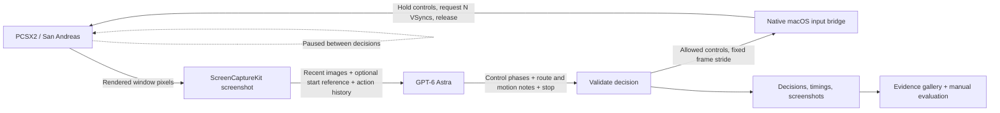

# GTA San Astra

**Give GPT-6 Astra a controller, a screenshot, and the next few frames.**

GTA San Astra is a visual driving experiment inside the PlayStation 2 version of *Grand Theft Auto: San Andreas*. Astra looks at the game, chooses controls, and sees what happens next. A native macOS bridge turns those decisions into PCSX2 input. The emulator pauses between decisions, making model latency independent of how much game time passes.

Astra builds the experiment and becomes its driving policy. The question is concrete: **can a visual model follow a road when pixels are its only sensor?**

[Two-minute demo guide](docs/DEMO.md) · [Recorded evidence](docs/EVIDENCE.md) · [Live validation](docs/TESTING.md) · [Private repository](https://github.com/PandelisZ/gta-san-astra)

## What works today

The native input and screenshot bridge, CLI, MCP server, bounded Astra runner, and evidence recorder are implemented. Four isolated emulator streams now compare autonomous driving policies from the same saved scene. The current wave has observed first right turns but has not proved a full block return. Concurrent runs also exposed a deficit between requested advances and recorded frames; [the timing investigation](docs/streams/timing-wave02-review.md) separates requested advances from recorded frames. Astra low has navigated the playable San Andreas world, entered a Blista Compact, and prepared a stationary-car snapshot. Live checks also cover screenshot capture, paused stepping at strides 1/5/10, and Astra's screenshot-to-control decisions.

**The road baseline has been captured and visually restored, and a 20-decision driving run has completed.** Restoration needed 66 neutral frame-advance requests to redraw an initially black screen; the displayed game clock advanced from 16:56 to 16:57, so this is not a bit-exact replay claim. The repository keeps recorded observations separate from driving-quality judgments. No benchmark score is claimed. The first attempt includes collisions and waiting in traffic. Its native recorder captured 898 frames (14.965 seconds), exported to individual PNGs and a game-speed MP4; see [recording instructions](docs/RECORDING.md). Completing a full block and visually returning to the starting road is the current goal; that route has not yet been proven.

## Video proofs

Uploaded recordings and provenance are collected in [GitHub issue #1](https://github.com/PandelisZ/gta-san-astra/issues/1). These are autonomous attempts, with collisions and recovery failures; none proves a completed loop. Playback follows actual simulation time, excluding paused inference gaps.

**Block attempt 03 — 51.65 seconds, two observed right turns, incomplete loop.**

https://github.com/user-attachments/assets/b4bbc3c2-f8af-49f6-a2a0-92e5126b6997

**Minute attempt 04 — 60.01 seconds, missed junction and curb/wall recovery failure.**

https://github.com/user-attachments/assets/638ea65b-b0aa-4192-a586-48535febb98d

**Minute attempt 05 — 60.01 seconds, heading and curb-recovery errors remain.**

https://github.com/user-attachments/assets/6951f5aa-bb5c-461f-98a3-33df283c93d8

The MP4s and metadata also remain versioned under [docs/videos](docs/videos). [Upload provenance](docs/evidence/video-uploads.json) records attachment URLs and checksums.




*Actual captured road baseline: the red Blista Compact at 16:56. The [snapshot evidence](docs/evidence/stationary-car.json) records its checksum and the visual replay check.*

## Preferred quiet starting snapshot

`quiet-tahoma` is the new local baseline: a blue Tahoma stopped beside a garden wall opposite Jefferson Motel, with the immediate area clear. Astra recovered from a carjacking, drove here, and verified no visible motion after handbrake bursts. The old `stationary-car` snapshot remains available. A fresh emulator process reloaded this snapshot and redrew the same car/location after 60 neutral frame requests; the displayed clock advanced one second.



With PCSX2 stopped, restore it using:

```sh
uv run python scripts/scenario.py launch quiet-tahoma --iso "$GAME_ISO"
```

The state stays in `.runtime/scenarios/quiet-tahoma/`, outside Git. [Snapshot metadata](docs/evidence/quiet-tahoma.json) is retained as evidence. A full loop around the block is still unproven.

## The loop



The policy receives no game memory, vehicle coordinates, speed, collision counters, or emulator debug telemetry. Save states are opaque reset artifacts; their contents never enter the policy prompt. The decision process has shell, browser, MCP/app, and web capabilities disabled.

The default driving burst requests 60 frames. Astra now chooses 1–6 sequential control phases whose frame counts must add up to that burst: for example, brake for 8 frames, coast for 12, then accelerate and steer for 40. Each phase selects its own buttons and duration. The validator rejects invalid controls, simultaneous acceleration/braking within a phase, and totals that differ from the fixed burst. The bridge supplies the final observation to the next decision. For a repeated menu confirmation, an empty-controls step lets the game sample the release before the next press. Consecutive driving actions can continue holding acceleration or steering.

Astra maintains a short `route_note` for landmarks and visually completed turns, plus a separate `dynamics_note` for observed travel, steering response, and prediction errors. Both notes are carried into later decisions alongside recent action history. An optional `--start-reference` image keeps the original landmark visible for loop verification. It is the model’s own visual memory, not telemetry. A commanded turn does not count as a completed turn; an around-the-block success requires seeing the starting landmark and road orientation again.

## Four judging criteria, one inspectable experiment

| Criterion | Weight | What this project demonstrates |
| --- | ---: | --- |
| GPT-6 Astra in development | 25% | Astra acted as the primary builder and coordinated three focused subagents across native input/capture, Python controls/MCP, and emulator integration. The implementation and fixes are recorded in Git history. |
| GPT-6 Astra in the project | 25% | Astra is the visual policy on every autonomous decision: screenshots in, validated PS2 controls out. Live vision, BIOS navigation, and the recorded driving attempt exercise this path. |
| Live demo | 25% | Show the paused emulator, one observation/action loop, a chosen stride, and the resulting evidence. A saved road scene and documented visual reset provide a starting point for repeated attempts. |
| Technicality | 25% | Native ScreenCaptureKit capture and keyboard injection, frame-step synchronization, strict decision validation, process locking, cleanup, CLI/MCP interfaces, and recorded evaluation artifacts. |

These are the judging categories, not claimed scores. Driving quality must be judged from the recorded game behavior.

## Run it locally

Requires macOS 14+, Xcode Command Line Tools, `uv`, PCSX2, a configured PS2 BIOS, and your local San Andreas image. The launcher defaults to the PCSX2 2.8.2 app on this machine. Game images, BIOS files, save states, and local recordings are excluded from Git.

```sh
sh scripts/bootstrap.sh

# Set this to your actual game image; quit PCSX2 before launching.
GAME_ISO="/absolute/path/to/San Andreas.iso"
uv run python scripts/setup_emulator.py --iso "$GAME_ISO" --launch
uv run san-astra doctor
uv run san-astra observe
```

Setup creates an isolated profile at `.runtime/pcsx2`, with separate memory cards and save states. The original PCSX2 profile is preserved. The experiment starts paused and binds frame advance to `N`. If `doctor` reports missing permissions, enable Accessibility and Screen & System Audio Recording for the host terminal/Codex app. Keep the emulator window visible.

### Choose which frames Astra sees

```sh
uv run san-astra --frame-stride 1 step --throttle   # request every frame
uv run san-astra --frame-stride 5 step --throttle   # request every fifth frame
uv run san-astra --frame-stride 10 step --throttle  # request every tenth frame
```

Any stride from 1 to 120 is supported; the driving runner defaults to 60. `step --frames N` overrides it for one action. The autonomous runner fixes the total stride throughout a run, across all model-selected phases. The older four-field decision format remains supported: only that fallback uses `--steer-pulse-frames` (12 by default; 0 holds steering throughout).

At NTSC 59.94 VSyncs/second, strides 1/5/10 nominally yield 59.94/11.99/5.99 observations per **game second**. Wall-clock cadence includes model and bridge latency. Requested VSyncs are not independent proof of delivered frames, and consecutive screenshots may contain the same rendered game image.

### Start an Astra run

Start from a paused driving scene. The runner defaults to authenticated Codex with `gpt-6-astra`, low reasoning effort, and fast mode, preferring the app-bundled CLI; no separate API key is needed. `SAN_ASTRA_CODEX` overrides the executable.

```sh
sh native/build-daemon.sh
RUN_DIR="runs/demo-$(date +%Y%m%d-%H%M%S)"
uv run python scripts/autodrive.py \
  --model gpt-6-astra --reasoning-effort low --service-tier fast \
  --policy-transport app-server --bridge-transport daemon \
  --steps 20 --frame-stride 60 \
  --vision-max-edge 512 --vision-quality 65 --vision-colormode rgb \
  --goal "Follow the road, stay in the lane, and avoid collisions." \
  --run-dir "$RUN_DIR"
uv run python scripts/report.py "$RUN_DIR"
```

The demonstrated configuration uses warm native-daemon and Codex app-server transports with 512-pixel RGB JPEG inputs. JPEG reduces bytes sent; fewer bytes alone do not establish lower vision-token usage. Raw PNGs remain available as evidence. The portable fallbacks are `--bridge-transport cli --policy-transport cli`.

When a controller targets a PID (`SAN_ASTRA_PID` or its `pid` argument), input and frame stepping use `--no-focus` in both native transports, including recording hotkeys. This overrides an input caller's `--focus` flag and avoids changing application focus between emulator instances. The shared actuation mutex still serializes input; an explicit `focus` command remains available when activation is intentional.

For visual route comparison, optionally pass `--start-reference /absolute/path/to/original-start.png` to the driving runner. Each decision receives the labeled baseline followed by the previous/current screenshots, at most three images; an identical starting file is attached only once. This is screenshot context only. Continuations inherit the original reference path from the prior run manifest unless explicitly overridden. Keep that original file available; a continuation screenshot should not replace the route baseline. The option is off by default.

The earlier recorded run used the fixed 12-frame steering / 48-frame continuation policy; it is not retroactive evidence for the new model-selected phases. That completed 20-decision run requested 1,200 emulated frames and took 273.18 wall-clock seconds. Median model-decision latency was 7.48 seconds, with variable multi-second calls. This is a paused simulation experiment, not realtime wall-clock autonomous driving. See [the measured run summary](docs/TESTING.md).

The runner stops at the decision limit, on a model stop decision, or on failure. Controls are released on exit, including Ctrl-C. Explicit release is also available:

```sh
uv run san-astra release
```

### Capture and reset a scenario

First position a stationary car on the road and pause emulation. Capture once, then restore that same scene for comparisons:

```sh
uv run python scripts/scenario.py capture stationary-car --iso "$GAME_ISO"

# Quit PCSX2 before restoring the named scenario.
uv run python scripts/scenario.py launch stationary-car --iso "$GAME_ISO"
```

The snapshot includes an integrity checksum, screenshot, and manifest. The current replay check restored the visible scene after 66 neutral frame-advance requests; those redraw steps also advanced the game clock, so comparisons must record that preparation. Existing names require `--replace` to overwrite. `autodrive.py --scenario-state .runtime/scenarios/stationary-car/state.p2s` records provenance only; use the scenario launcher to actually load the state.

## Interfaces and evidence

```sh
uv run san-astra step --frames 10 --throttle --steer left
uv run san-astra step --frames 5 --brake
uv run san-astra step --frames 5 --buttons triangle
SAN_ASTRA_FRAME_STRIDE=5 uv run san-astra mcp
```

MCP exposes `observe`, `step`, `action`, `release`, and `doctor`; observation tools return PNG image content. `.codex/config.toml` registers the server for a trusted session in this checkout. Update its absolute paths if the repository moves. `action` provides timed realtime input; the autonomous runner uses paused `step` instead.

| Driving action | PS2 control | Keyboard binding |
| --- | --- | --- |
| Accelerate | Cross | K |
| Brake / reverse | Square | J |
| Steer | Left stick | A / D |
| Enter / exit | Triangle | I |
| Handbrake | R1 | E |
| Game menu | Start | Return |
| Move on foot | Left stick | W / S |

The controller reads bindings from the experiment profile. Steering uses digital stick directions; this prototype does not provide a continuously variable analog axis. Screenshots crop the 32-pixel window titlebar by default; set `--crop-top 0` or `SAN_ASTRA_CROP_TOP=0` for fullscreen.

Each run records screenshots, requested controls, model decisions, latency, and failures. `run_manifest.json` and `run_summary.json` identify the model, goal, stride, scenario provenance, decision/action counts, requested game frames, and elapsed wall time. The HTML report includes final observations even when there is no subsequent decision. Optional `--annotations ratings.json` adds human observations keyed by decision number.

Evaluate road following, visible collisions, pedestrian avoidance, recovery, and completion from the images. Model rationale and requested frame counts are evidence about the experiment, not ground-truth driving scores.

## Validate

```sh
uv run --extra test pytest
python3 native/smoke.py
```

Tests cover input bounds, locks, cleanup, cadence, decision validation, scenario handling, MCP responses, and evidence rendering. Native smoke checks require a visible running PCSX2 window. Live results and remaining gates are documented in [docs/TESTING.md](docs/TESTING.md).

Implementation references: [PCSX2 hotkeys](https://github.com/PCSX2/pcsx2/blob/v2.8.2/pcsx2/Hotkeys.cpp), [PCSX2 frame stepping](https://github.com/PCSX2/pcsx2/blob/v2.8.2/pcsx2/VMManager.cpp), [Codex noninteractive execution](https://developers.openai.com/codex/noninteractive/).
