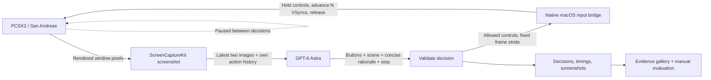

# GTA San Astra

**Give GPT-6 Astra a controller, a screenshot, and the next few frames.**

GTA San Astra is a visual driving experiment inside the PlayStation 2 version of *Grand Theft Auto: San Andreas*. Astra looks at the game, chooses controls, and sees what happens next. A native macOS bridge turns those decisions into PCSX2 input. The emulator pauses between decisions, making model latency independent of how much game time passes.

Astra builds the experiment and becomes its driving policy. The question is concrete: **can a visual model follow a road when pixels are its only sensor?**

[Two-minute demo guide](docs/DEMO.md) · [Recorded evidence](docs/EVIDENCE.md) · [Live validation](TESTING.md) · [Private repository](https://github.com/PandelisZ/gta-san-astra)

## What works today

The native input and screenshot bridge, CLI, MCP server, bounded Astra runner, and evidence recorder are implemented. Astra low has navigated the playable San Andreas world, entered a Blista Compact, and prepared a stationary-car snapshot. Live checks also cover screenshot capture, paused stepping at strides 1/5/10, and Astra's screenshot-to-control decisions.

**A cleaner driving location, snapshot replay verification, and latency tuning are in progress.** The repository keeps recorded observations separate from claims about driving quality. No driving benchmark score is claimed.


*Actual game screenshot after Astra low entered the car. The named snapshot and its checksum are recorded locally; replay verification is the next gate.*

## The loop



The policy receives no game memory, vehicle coordinates, speed, collision counters, or emulator debug telemetry. Save states are opaque reset artifacts; their contents never enter the policy prompt. The decision process has shell, browser, MCP/app, and web capabilities disabled.

Controls remain held for the chosen stride. After each action, the bridge releases host keys and captures a screenshot. For a repeated menu confirmation, an empty-controls step lets the game sample the release before the next press. Consecutive driving actions can continue holding acceleration or steering.

## Four judging criteria, one inspectable experiment

| Criterion | Weight | What this project demonstrates |
| --- | ---: | --- |
| GPT-6 Astra in development | 25% | Astra acted as the primary builder and coordinated three focused subagents across native input/capture, Python controls/MCP, and emulator integration. The implementation and fixes are recorded in Git history. |
| GPT-6 Astra in the project | 25% | Astra is the visual policy on every autonomous decision: screenshots in, validated PS2 controls out. Live vision and BIOS control evidence exercise this path. |
| Live demo | 25% | Show the paused emulator, one observation/action loop, a chosen stride, and the resulting evidence. A saved starting scene enables repeatable driving attempts once prepared. |
| Technicality | 25% | Native ScreenCaptureKit capture and keyboard injection, frame-step synchronization, strict decision validation, process locking, cleanup, CLI/MCP interfaces, and recorded evaluation artifacts. |

These are the judging categories, not claimed scores. Driving quality must be judged from the recorded game behavior.

## Run it locally

Requires macOS 14+, Xcode Command Line Tools, `uv`, PCSX2, a configured PS2 BIOS, and your local San Andreas image. The launcher defaults to the PCSX2 2.8.2 app on this machine. Game images, BIOS files, save states, and local recordings are excluded from Git.

```sh
sh scripts/bootstrap.sh

# Set this to your actual game image; quit PCSX2 before launching.
GAME_ISO="/absolute/path/to/San Andreas.iso"
uv run python scripts/setup_emulator.py --iso "$GAME_ISO" --launch
uv run san-astra doctor
uv run san-astra observe
```

Setup creates an isolated profile at `.runtime/pcsx2`, with separate memory cards and save states. The original PCSX2 profile is preserved. The experiment starts paused and binds frame advance to `N`. If `doctor` reports missing permissions, enable Accessibility and Screen & System Audio Recording for the host terminal/Codex app. Keep the emulator window visible.

### Choose which frames Astra sees

```sh
uv run san-astra --frame-stride 1 step --throttle   # request every frame
uv run san-astra --frame-stride 5 step --throttle   # request every fifth frame
uv run san-astra --frame-stride 10 step --throttle  # request every tenth frame
```

Any stride from 1 to 120 is supported. `step --frames N` overrides it for one action. The autonomous runner fixes the stride for the entire run; Astra cannot change it.

At NTSC 59.94 VSyncs/second, strides 1/5/10 nominally yield 59.94/11.99/5.99 observations per **game second**. Wall-clock cadence includes model and bridge latency. Requested VSyncs are not independent proof of delivered frames, and consecutive screenshots may contain the same rendered game image.

### Start an Astra run

Start from a paused driving scene. The runner defaults to authenticated Codex with `gpt-6-astra`, low reasoning effort, and fast mode, preferring the app-bundled CLI; no separate API key is needed. `SAN_ASTRA_CODEX` overrides the executable.

```sh
RUN_DIR="runs/demo-$(date +%Y%m%d-%H%M%S)"
uv run python scripts/autodrive.py \
  --model gpt-6-astra --reasoning-effort low --service-tier fast --steps 20 --frame-stride 10 \
  --goal "Follow the road, stay in the lane, and avoid collisions." \
  --run-dir "$RUN_DIR"
uv run python scripts/report.py "$RUN_DIR"
```

The runner stops at the decision limit, on a model stop decision, or on failure. Controls are released on exit, including Ctrl-C. Explicit release is also available:

```sh
uv run san-astra release
```

### Capture and reset a scenario

First position a stationary car on the road and pause emulation. Capture once, then restore that same scene for comparisons:

```sh
uv run python scripts/scenario.py capture stationary-car --iso "$GAME_ISO"

# Quit PCSX2 before restoring the named scenario.
uv run python scripts/scenario.py launch stationary-car --iso "$GAME_ISO"
```

The snapshot includes an integrity checksum, screenshot, and manifest. Existing names require `--replace` to overwrite. `autodrive.py --scenario-state .runtime/scenarios/stationary-car/state.p2s` records provenance only; use the scenario launcher to actually load the state.

## Interfaces and evidence

```sh
uv run san-astra step --frames 10 --throttle --steer left
uv run san-astra step --frames 5 --brake
uv run san-astra step --frames 5 --buttons triangle
SAN_ASTRA_FRAME_STRIDE=5 uv run san-astra mcp
```

MCP exposes `observe`, `step`, `action`, `release`, and `doctor`; observation tools return PNG image content. `.codex/config.toml` registers the server for a trusted session in this checkout. Update its absolute paths if the repository moves. `action` provides timed realtime input; the autonomous runner uses paused `step` instead.

| Driving action | PS2 control | Keyboard binding |
| --- | --- | --- |
| Accelerate | Cross | K |
| Brake / reverse | Square | J |
| Steer | Left stick | A / D |
| Enter / exit | Triangle | I |
| Handbrake | R1 | E |
| Game menu | Start | Return |
| Move on foot | Left stick | W / S |

The controller reads bindings from the experiment profile. Steering uses digital stick directions; this prototype does not provide a continuously variable analog axis. Screenshots crop the 32-pixel window titlebar by default; set `--crop-top 0` or `SAN_ASTRA_CROP_TOP=0` for fullscreen.

Each run records screenshots, requested controls, model decisions, latency, and failures. `run_manifest.json` and `run_summary.json` identify the model, goal, stride, scenario provenance, decision/action counts, requested game frames, and elapsed wall time. The HTML report includes final observations even when there is no subsequent decision. Optional `--annotations ratings.json` adds human observations keyed by decision number.

Evaluate road following, visible collisions, pedestrian avoidance, recovery, and completion from the images. Model rationale and requested frame counts are evidence about the experiment, not ground-truth driving scores.

## Validate

```sh
uv run --extra test pytest
python3 native/smoke.py
```

Tests cover input bounds, locks, cleanup, cadence, decision validation, scenario handling, MCP responses, and evidence rendering. Native smoke checks require a visible running PCSX2 window. Live results and remaining gates are documented in [TESTING.md](TESTING.md).

Implementation references: [PCSX2 hotkeys](https://github.com/PCSX2/pcsx2/blob/v2.8.2/pcsx2/Hotkeys.cpp), [PCSX2 frame stepping](https://github.com/PCSX2/pcsx2/blob/v2.8.2/pcsx2/VMManager.cpp), [Codex noninteractive execution](https://developers.openai.com/codex/noninteractive/).
