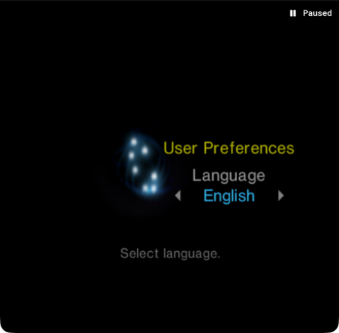
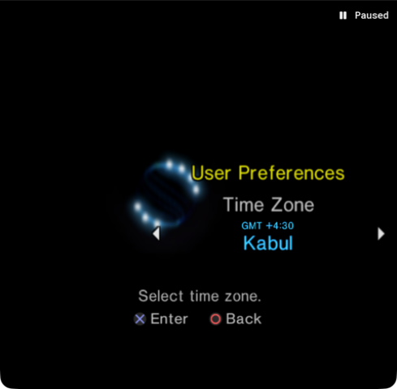
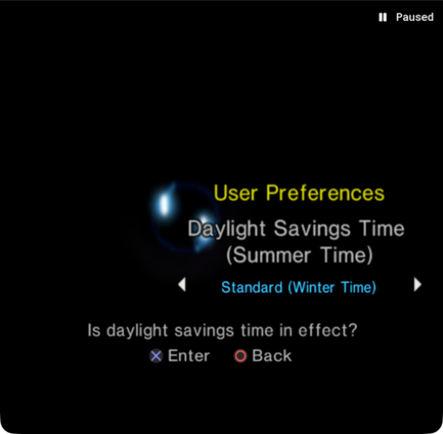
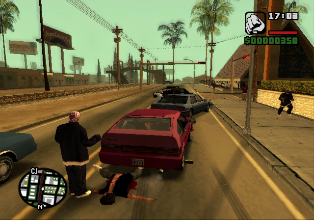

# Evidence for judges

These are real emulator captures and final structured Astra decisions from September 8, 2026. They establish the image → model decision → controller input → new image loop in the PS2 BIOS and GTA. The first recorded GTA attempt includes collisions and waiting; it does **not** establish collision-free autonomous driving.

The PNG files below were copied unchanged from recorded runs. Their existing 32-pixel title-bar crop was applied by the capture bridge. [The manifest](evidence/manifest.json) records SHA-256 hashes. Raw local paths, process IDs, private configuration, and model execution transcripts are excluded from this compact package.

## What was actually observed

| UTC time | Check | Recorded outcome |
| --- | --- | --- |
| 17:22:51 | Astra visual recognition | Classified the PS2 boot-logo screenshot as a menu and chose to stop. No controls applied. Decision latency: 7,361.26 ms. |
| 17:23:53–17:24:31 | Astra BIOS control loop | Three `cross` decisions with 120 frame-advance requests per action. Captures progressed from Language through Time Zone to Daylight Savings Time. |
| 17:24:35 | Live MCP observation | Server returned `image/png`, 489 × 480 pixels. Capture duration: 196.39 ms. This check only observed. |
| 17:26:23–17:26:29 | Pause and stride checks | Two paused captures were byte-identical. Commands requested 1, 5, and 10 frame advances and returned captures. |

The visual-recognition decision is preserved in [vision-decision.json](evidence/vision-decision.json). Its input was the PS2 boot logo; that input is omitted from this three-image selection. The three later controller decisions and their measured latencies are preserved in [bios-decisions.json](evidence/bios-decisions.json).

### Before: language selection

At 17:23:53 UTC, the captured screen showed English selected. Astra chose `cross`. Its next decision again chose `cross`; this is recorded behavior, not a claim that each button press immediately changed the menu.

### Intermediate: time zone

At 17:24:18 UTC, the resulting capture showed the Time Zone menu. Astra's third final decision identified that menu and chose `cross`. This is menu-navigation evidence, not a configured location or a driving measurement.

### After: the screenshot returned through MCP

At 17:24:35 UTC, a separate live MCP `observe` call returned this Daylight Savings Time screen. [mcp-observation.json](evidence/mcp-observation.json) preserves its MIME type, dimensions, latency, and the tools discovered at that test. Later-added tools are not retroactively claimed as part of this earlier check.

## Timing and cadence

| Requested stride | Native input execution | Controller action wall time | Subsequent capture |
| --- | ---: | ---: | ---: |
| 1 | 56.89 ms | 1,252.81 ms | 198.77 ms |
| 5 | 246.80 ms | 1,432.60 ms | 199.78 ms |
| 10 | 473.89 ms | 1,656.64 ms | 200.31 ms |

These are individual smoke-test measurements, not averages or a performance benchmark. Native execution covers control events through release. Controller action wall time also includes process launch, focus, and cleanup; it excludes the subsequent screenshot and model inference. The three BIOS decision latencies were 5,773.79, 6,069.87, and 5,794.93 ms. [stride-checks.json](evidence/stride-checks.json) contains the exact values and result-image hashes.

A stride is a number of frame-advance **requests**. Without emulator telemetry, this package does not assert a matching count of unique rendered frames, real-time driving, collision rates, distances, lane-keeping scores, or speed.

## Development record

The repository contained **6 commits through `a405c93`** when this evidence snapshot was assembled:

| Commit | Recorded change |
| --- | --- |
| `b7d7ed7` | Native bridge, Python controls/MCP, and Astra driving loop |
| `189e20b` | Rejected profile paths escaping through symlinks |
| `6293bf7` | Live MCP and stride evidence; a CI workflow was added at this point |
| `e769e85` | Isolated BIOS preferences |
| `5fb299b` | Removed the CI workflow; verification remains local |
| `a405c93` | Named emulator snapshots for repeatable scenarios |

Development was divided across Codex task scopes for the native macOS bridge, Python controller/MCP, emulator setup and evaluation tooling, and integration/live verification. These are implementation scopes, not independent driving trials or performance scores. The commit count is a fixed historical snapshot and excludes later documentation commits. No private task transcript is included.

## Recorded GTA attempt

A stationary red Blista Compact scenario was captured and successfully reloaded. Astra low/Fast then completed 20 decisions using a persistent policy process, a warm native capture daemon, and 512-pixel JPEG observations. It accelerated, braked, and waited behind blocked traffic. The recording shows collisions, including a pedestrian beneath the car. No collision-free or distance score is claimed.

| Measurement | Observed value |
| --- | ---: |
| Decisions | 20 |
| Requested frame advances | 1,200 |
| Frames decoded from native recording | 898 |
| Native recording duration | 14.965 seconds |
| Wall time | 273.177 seconds |
| Median model decision latency | 7,483.21 ms |
| Median capture latency | 97.69 ms |

Requested hotkey pulses are not a reliable delivered-frame count: this run recorded fewer frames than requested. All 898 stored frames were decoded into PNGs; playback preserves the recording timestamps. The lossless master, PNGs, MP4, full decision logs, and HTML report remain in Git-ignored local folders. [Compact result metadata](evidence/driving-attempt-1.json) preserves the measurements and master hash.

Local artifacts:

- `runs/recordings/driving-attempt-1/playback.mp4`
- `runs/recordings/driving-attempt-1/frames/`
- `runs/driving-demo-01/report.html`

See [recording instructions](RECORDING.md) to reproduce the capture/export process. The recorded outcome is an integration result, not a claim of wall-clock realtime model control.

After this run, frame-key timing was increased to 10 ms held plus 90 ms settling. A separate neutral 60-request calibration recorded and decoded exactly 60 frames. This is one observed calibration, not a guarantee under every load. The original 898-frame attempt is retained unchanged.
