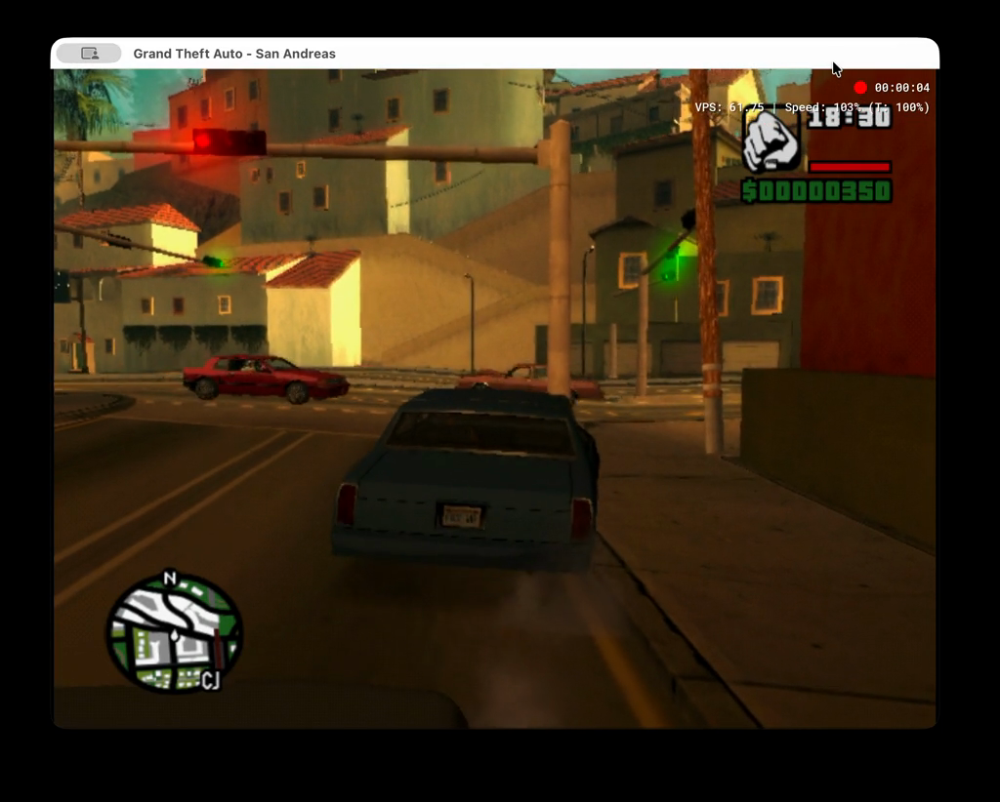
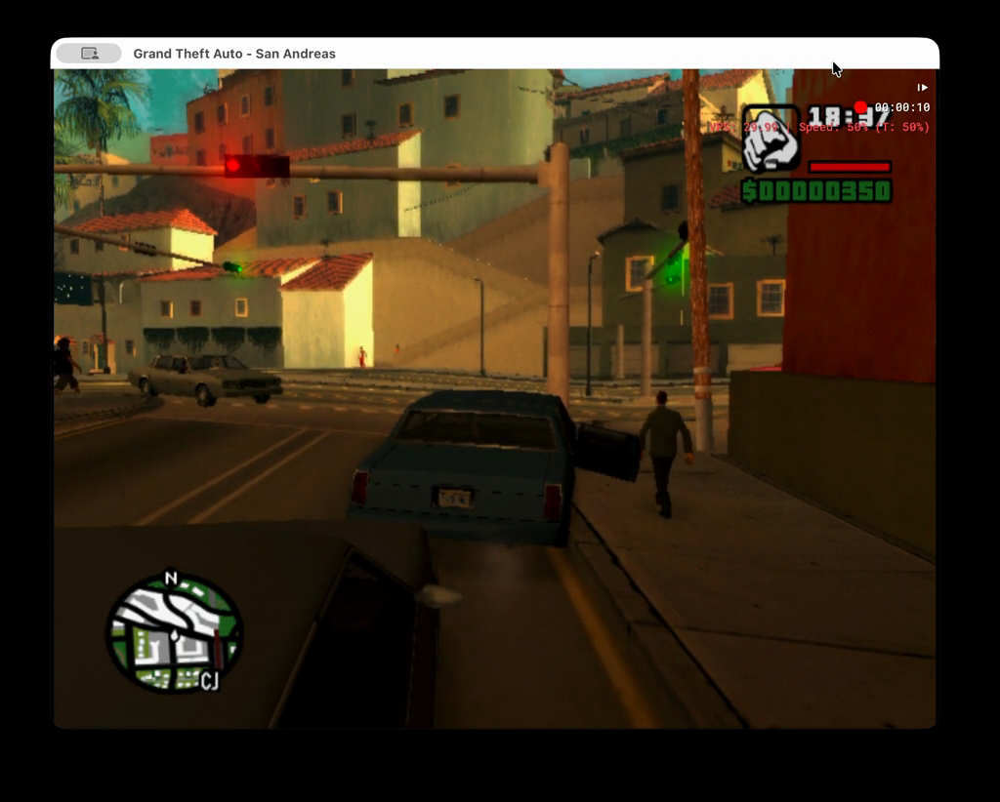
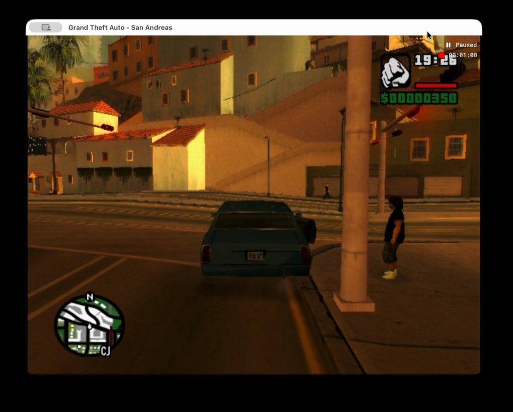

# Flow minute 01 review

**One simulation minute completed; no route turn or return.** The car remained on the original approach near the right curb and pole. PID 79892 is paused at normal speed, both recorders finalized, and no reset or second trial has started.

[Sharing video: full real elapsed time](../videos/flow-minute-01-share.mp4) · [Share provenance](../videos/flow-minute-01-share.json) · [All 12 decisions and source evidence](flow-minute-01-evidence.json)

## Recording and mode proof

| Measure | Observed |
| --- | --- |
| Native stored/decoded frames | 3618; all PNGs preserved |
| Native fixed-rate simulation playback | 60.36 seconds |
| Actual wall-clock video | 109.68 seconds |
| Policy decisions/actions | 12/12 |
| Nominal action budget | 720 frames; excludes inference advancement |
| Inference model | gpt-6-astra, low, fast |
| Median inference latency | 7.284 seconds |
| Source configuration | shared main 1fa50c4, mode flow, 60-frame action plans |
| Share artifact | 1024×822, 8.55 MB, 2393 selected frames, 21.82 average FPS |
| Validation | 14 flow/setup tests passed; both full/share MP4s decode without errors |

The wall-clock recorder PID 80128 ran throughout and finalized a 501,865,759-byte MOV. The original full-resolution MP4 remains at `runs/flow-minute-01/recording/wall-clock.mp4` (also copied by the wrapper into the untracked full-resolution docs MP4). The 1.445 GB native MKV and all 3618 PNGs remain in the original ignored runtime/run paths. Only the smaller sharing video is added to Git.

The sharing derivative selects source frames at their original timestamps, scales to 1024 pixels wide and encodes H.264 CRF22. It retains variable frame timing and the final source frame; no speed change or `setpts` is used. Both full and share videos measure109.68 seconds. Visual samples at 20s, 95s and 109.5s match the original scenes. Native-frame playback must not be used to demonstrate the half-speed interval because its fixed-rate playback removes that wall-time effect.

The action sample shows VPS 61.75, speed 103%, target 100%. Native action logs also show approximately one second of running time per plan, no pause toggle and return to slow mode.

Inference samples at 20, 40, 70 and 95 wall seconds show approximately 29.8–30 VPS and 50% actual/target speed. The final image shows Paused; the runner restored the normal limiter on exit.

## What limited progress

Steps 0–4 approached and yielded to traffic and a person near the open door. Steps 5–8 tried brief powered-left clearance and a limited reverse with a vehicle close behind. Images show tight curb/pole geometry and little progress, followed by better forward response in steps 9–11. No completed turn was observed. The final image remains before the first turn. This is not evidence that the model drove a block or returned.

The strongest visual explanation is a combination of constrained curb/pole clearance, close rear traffic, and short powered phases followed by handbrake. Several longer inference intervals show the car staying nearly fixed while pedestrians/traffic move; this run does not establish large uncontrolled coasting as the main failure. Exact contact forces or vehicle speed are unavailable from these screenshots.

There is nevertheless a clear observation/accounting defect: consecutive post-action images bracket the preceding inference interval plus the next action, while dynamics notes repeatedly attribute all displacement to the short action plan alone. Current screenshots were only 0.24–0.54 seconds old at model invocation (median 0.484), but 6.49–9.17 seconds old when the decision returned (median 7.782). A fresh pre-inference capture saves roughly half a second, not the full latency. At half speed, the measured 5.98–8.70 second inference calls permit approximately 3.0–4.35 seconds of game evolution before the new action.

## Proposed next experiment, not implemented

First make image timestamps, observation interval, prior inference duration and complete prior control history explicit. Refresh the image immediately before inference, while clearly preserving that it will age during the request. Have the model judge the whole previous cycle and forecast the upcoming inference horizon rather than treating every displacement as the effect of one second of controls.

An explicit model-selected `thinking_buttons` field with default `[]` is a reasonable additional control capability. It would allow a deliberate brake/handbrake, coast or throttle choice during inference, instead of compulsory neutral controls. This run does not prove that it solves the curb restriction. Any choice must be forecast over several game seconds, including variable latency; sustained steering/throttle can turn a small error into a collision. Keep the choice model-owned, retain validation/release-on-failure, and record exactly what was held. Do not hardcode a driving choice or claim improvement without a new fixed-policy comparison.

No code for that proposal was implemented here. Reset remains held for coordinator review.

**Current raw-media availability:** Later task-archive cleanup removed the route worktree and its ignored raw files. Share videos and copied evidence remain; flow01 also has a separately verified lossless archive in the main checkout. See the [retention incident](../evidence/route-worktree-retention-incident.json).
