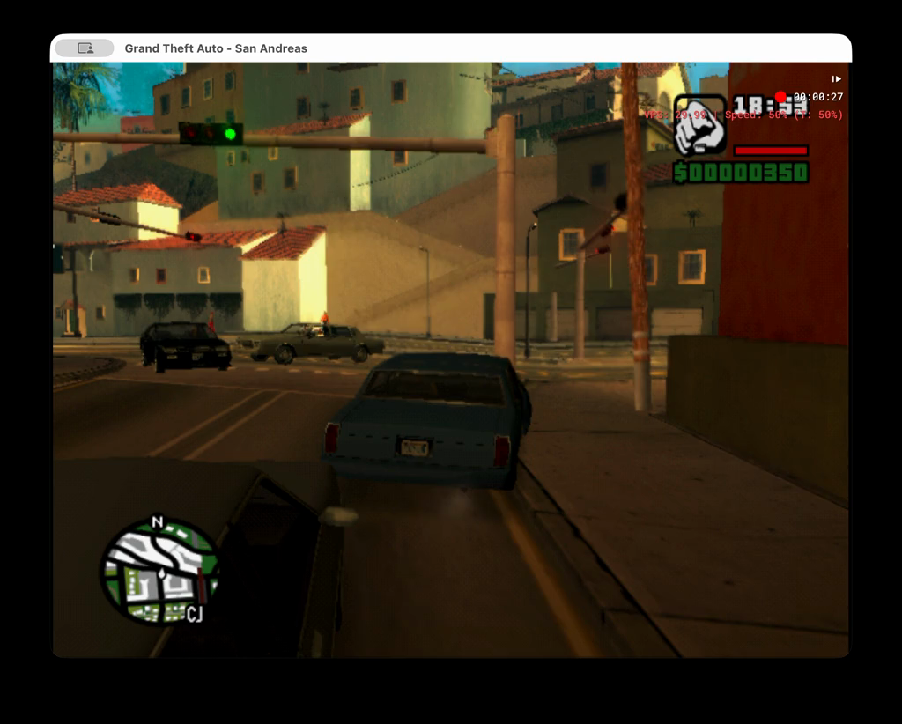
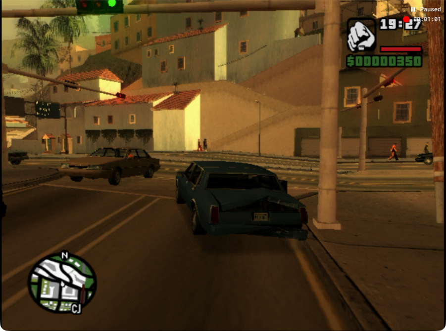

# Flow minute 02: capability verified, loop incomplete

**The model used inference controls and all four motion images, but completed zero turns.** It remained near the first junction, with tight curb/pole clearance and traffic around it. Additional rear damage is visible in the final images. No route success or causal improvement is claimed from this run.

[Full wall-clock demo](../videos/flow-minute-02.mp4) · [Video provenance](../videos/flow-minute-02.json) · [All decisions and native control evidence](flow-minute-02-evidence.json)

| Measure | Observed |
| --- | --- |
| Native frames preserved | 3683, all decoded PNGs retained |
| Native simulation duration | 61.44 seconds |
| Wall-clock demo | 111.83 seconds, 8,819,895 bytes |
| Decisions / applied actions | 13 / 12 |
| Nominal normal-speed action budget | 720 frames; excludes inference advancement |
| Inference median latency | 6.294 seconds |
| Policy | gpt-6-astra, low, fast; screenshots only |
| Source | shared main 25d84d0 selected files |
| Verification | 21 flow/setup tests passed; MP4 complete decode passed |

Target was crossed during decision 12's inference. That final decision is retained but its plan was not applied; runner then released controls, paused and restored normal speed. The read-only final screenshot confirms Paused on sole PID 82617. No reset or additional trial has occurred.

## What the new capability actually did

Decision 0 selected `thinking_buttons: []`. Decisions 1–12 selected `['r1']`. Eleven applied native plans after the first recorded handbrake mapped to keyboard `e` for the half-speed inference interval; decision 12 was not applied. This was the model's choice, not a host-imposed brake policy.

Decision 0 had baseline/current images because no previous cycle existed. Every later decision received four images labeled baseline reference, before previous inference, after previous inference/before action, and after action/current. The policy transport retains all four. For decision 1, timestamp intervals were 9.595 wall seconds across the prior inference and 1.436 wall seconds across action/capture. The fixed baseline has no motion timestamp and is excluded from those intervals. Prompts included recent measured latency and the currently held thinking controls.

The model used the distinctions in notes such as “handbrake and inference hold produced no appreciable displacement.” Some notes still abbreviated this as the prior action's effect, so four images alone do not guarantee precise causal reasoning. A labeled pre-action image audits drift for the next decision; it never silently changes the already-selected action.

The movie samples show 50% actual/target speed during inference and normal-speed action targets. Native logs record continuous mode and approximately one-second action plans. The compressed movie preserves the full elapsed timeline. Full MOV, native MKV and all 3683 source PNGs remain in the run/runtime folders.

## Driving result and next review

The early decisions waited for cross traffic/pedestrians and repeatedly used short powered phases followed by handbrake. Longer straight throttle still produced little useful advance. A left correction and brief reverse attempted to release the apparent curb restriction; the car finally yawed left toward the lane interior, but traffic still constrained entry. It ended before the first turn with rear-right near the curb and additional visible rear damage.

This confirms the host can carry model-selected controls through inference and provide phase-separated visual evidence. It does not establish better route progress: flow01 and flow02 both completed zero turns. More stable holding may help prevent drift while also keeping the car exposed to nearby traffic. The source images support curb/traffic constraints; they do not establish exact contact mechanics.

Before another trial, review the geometry around the front corner and rear vehicle and whether the model is choosing sufficiently useful, visually justified clearance maneuvers. Keep the next change narrow and fixed for its trial. No further prompt changes, manual driving, baseline relocation, or reset were made here.

**Current raw-media availability:** Later task-archive cleanup removed the route worktree and its ignored raw files. Share videos and copied evidence remain; flow01 also has a separately verified lossless archive in the main checkout. See the [retention incident](../evidence/route-worktree-retention-incident.json).
