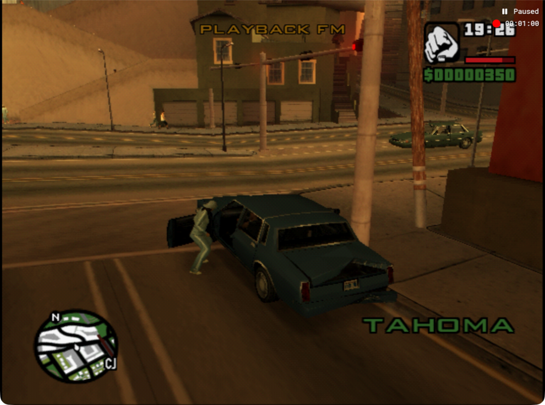

# Flow minute 03: compact policy, no completed turn

**Zero verified turns; the car remained at the first junction and CJ was pulled outside late in the trial.** Budget context and shorter output were valid, but this run does not establish better driving or a meaningful latency improvement.

[Full elapsed-time video](../videos/flow-minute-03.mp4) · [Provenance](../videos/flow-minute-03.json) · [Decisions and native events](flow-minute-03-evidence.json)

| Measure | Result |
| --- | --- |
| Native capture | 3647 frames, 60.84 simulation seconds; every PNG retained |
| Full wall-clock share | 110.70 seconds, 3321 frames, 6,485,651 bytes |
| Decisions / applied actions | 13 / 12; final candidate not applied after target crossed during inference |
| Action budget | 720 nominal frames, excluding inference motion |
| Median inference | 6.080 seconds, versus flow02 6.294 seconds |
| Model | gpt-6-astra, low, fast; screenshot-only |
| Changed source | ae6d49d autodrive.py and decision.schema.json only |
| Verification | 21 flow/setup tests; full MP4 decode; visual samples at15/65/95/110 seconds |

The original right-lane-junction state was restored unchanged. A neutral60-frame redraw was used before capture to clear the initial black frame. All gameplay controls then came from the model. The target, elapsed recorded lower bound and remaining upper estimate were supplied by the imported prompt. All13 outputs met rationale120/route180/dynamics220 character limits. Every decision after the first received four images. Thinking controls were neutral initially, handbrake for decisions1–8, then neutral for9–12; the final candidate was not applied. Actions used100% speed and inference50%. No prompt changes occurred during the run.

## Phase evidence and driving result

Early holds admitted cross traffic while a following car closed in. The right door was already open in action2's phase images. Rear deformation later makes collision damage visible. Reverse-right action5 gained retreat/yaw but brought the rear close to the following car. Action6 then gained clear forward distance: the following car fell out of view and the pole base shifted rearward relative to our car. That useful movement did not complete a turn or establish a clear front-right corridor.

The relevant phase sequence is in `runs/flow-minute-03/20260908-154125-6cb2aca0/`: action6 begins at `frame-1788907343175544000.png` and ends at `frame-1788907344582646000.png`; the next inference ends at `frame-1788907351302331000.png`, then action7 ends at `frame-1788907352685277000.png`. Across that inference, forward movement is small and a person appears beside the driver door. The following action gains little distance while the entry/attack interaction escalates. Later images clearly show CJ outside under attack; final entry/occupancy remains uncertain.

This supports testing the lesson that an observation boundary alone should not end useful motion when observed alignment, a clear corridor and stopping room support continuation. It does **not** prove stopping was caused solely by the end-of-action handbrake or that the hold initiated the door interaction: the door was open earlier, front-right clearance remained tight, and occupancy/interaction could interrupt driving. Weak displacement after throttle plus braking is insufficient evidence of a physical blockage.

The native MKV,3647 PNGs, full MOV and original CRF22 MP4 remain intact. The shared CRF26 derivative preserves the complete elapsed timeline at30fps with no retiming. The final read-only screenshot confirms paused PID85270; recording stop was sent and the capture finalized. No further reset was performed before this report was committed.

