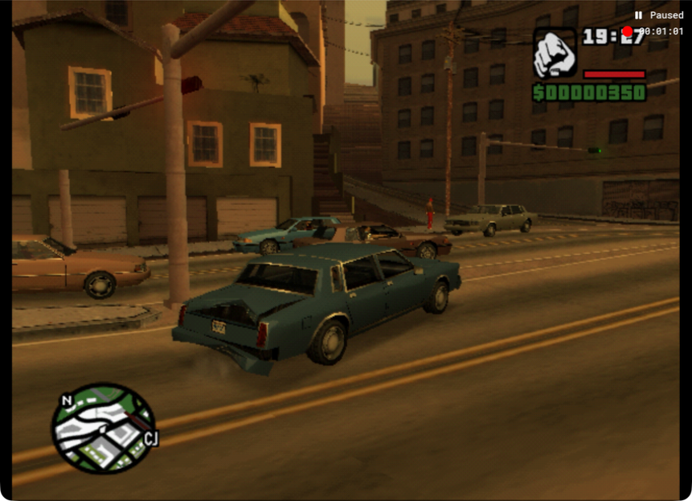

# First main-task flow run

The requested run executed directly from the main checkout after the separate route task stopped. The car reached the first right-turn heading, but remained near/on the wrong side of the destination centerline and still needed lane recovery. It did not complete a block return. Curb/pole contact and reversing were part of the attempt; this is not a clean-driving success.

The run preserved 3,705 native frames (61.81 simulation seconds), plus a complete 112.90-second elapsed-time video. Thirteen decisions produced twelve applied 60-frame nominal actions. The final decision crossed the buffered recording target during inference and was retained without executing its plan. The emulator was then paused and controls released; the final read-only screenshot visibly confirms Paused.

Astra used the accumulated corner-clearance, motion, braking, traffic and door-interaction guidance, concise visual memory, four phase-labelled images, explicit thinking controls and approximate remaining trial budget. The model remained gpt-6-astra with low reasoning and fast tier. Median inference latency was 6.247 seconds. Some longer powered phases and coasting intervals replaced repeated handbrake holds, but overshoot and lane control remained unresolved.

The final alignment is supported by the vehicle axis relative to the destination road and its centerline, together with the changed street view. It does not prove right-lane occupancy or a return to the original starting landmark. Continued travel after some requested braking still warrants investigation; the input mapping alone cannot establish physical stopping behavior.

The share movie was fully decoded and sampled visually at 1, 40, 80 and 110 seconds. Its 3,387 frames preserve the full 112.90-second timeline at 30 fps; all 3,705 emulator frames are retained separately. The share file is 7,729,086 bytes. The game window changed size during the run, which is reflected in capture metadata and the video; no driving controls were supplied by the supervisor.

Raw media for this run lives under the main checkout's `runs/flow-minute-05-main` and `.runtime/main-flow`, independently of the retired task's worktree. Before this run, an attempted launch from the old profile failed before recording or driving when task-archive cleanup removed that profile. That failure is retained in `runs/flow-minute-05/attempt.json`. The earlier raw-media loss is documented separately in the [retention incident](../evidence/route-worktree-retention-incident.json).

[Full video](../videos/flow-minute-05-main.mp4) · [Video metadata](../videos/flow-minute-05-main.json) · [All decisions and native events](flow-minute-05-main-evidence.json)

