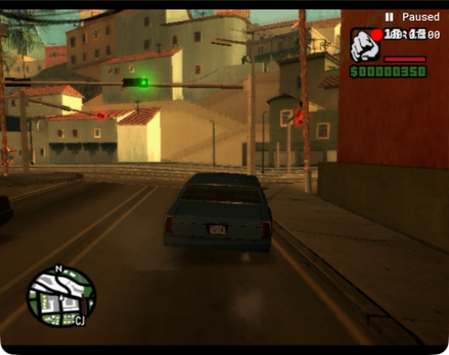

# Route continuity stream

Worktree: `/Users/pz/.codex/worktrees/4ed4/oaihackathon`.
Shared harness: `0ac5edd`; isolated emulator PID `66584`.
Profile: `.runtime/stream-route/pcsx2`; shared read-only scenario `quiet-tahoma`.

## Pretrial change

The driving prompt now preserves an immutable visual start fingerprint (two distinctive landmarks and their left/right relationship to travel direction), explicitly marks a missed circuit unresolved, and requires landmark relationships plus road-edge heading to agree before claiming return. This is general screenshot-only route guidance, without a prescribed driving sequence. Existing model, low reasoning, fast service, input locks, and control policy remain intact.

Prepared baseline with 60 neutral frame requests before capture. One attempt planned: `stream-route-minute-01`, 640-pixel vision, target 3597 actually recorded frames. Every gameplay decision comes from the existing screenshot-only policy. No second attempt before coordination.

## Coordinated stop, no driving trial completed

The daemon startup failed before the first observation (`Native daemon timed out after 15 seconds`). Its driver reported zero decisions/actions/requests. Added an explicit `--bridge-transport cli` wrapper option, preserving daemon as default, then retried the same paused PID with the same prompt/model under `stream-route-minute-01-cli`. CLI captured successfully (199.56ms), but the coordinator requested all streams stop while investigating another stream's unexplained advancement. Sent SIGINT only to owned wrapper PID 67558; it interrupted owned driver 67588 and finalized this PID's recorder. Both processes exited; emulator PID 66584 remains open. No further controls or reset were issued.

Both retained MKVs are 533-byte zero-frame files. Frame counting reports zero; no decodable frames or valid MP4 exists, so no video is manufactured. Each driver summary records zero decisions and zero gameplay frames requested. The CLI attempt was interrupted after 7.054 wall seconds. The recorded minute target was NOT reached. Route return and the prompt improvement are untested.

The last CLI observation visibly says Paused and shows the Tahoma beside the starting garden wall, orange motel across the road, and clock 17:19. This stream's evidence does not establish the cause of other streams' advancement.

Machine-readable provenance: [startup evidence](route-startup-evidence.json). Raw evidence remains in `runs/stream-route-minute-01*`, with both masters under `.runtime/stream-route/pcsx2/videos/`.

## Validation and next step

`tests/test_autodrive.py`: 4 passed, 6 failed, 11 subtests passed. All six failures reproduce against isolated copies of the unmodified shared harness commit 0ac5edd (mock controller PID is not JSON serializable). No live-policy changes were made in response.

Lesson: startup capture and confirmed paused isolation must be established before judging route behavior. Proposed next improvement: coordinator-owned no-input recording verification per isolated PID before restarting the unchanged route policy. After that gate, run one real minute and evaluate whether the fingerprint survives actual turns; do not tune from zero-decision startup failures.

## Corrected harness attempt 02

Coordinator handed back reset/warmed PID 69729 after shared four-game isolation proof:60 recorded frames on the tested PID and zero on the others. Integrated only `control.py` and `daemon.py` from shared main 90149e5, retaining this stream's exact driving prompt. Scoped input now uses `--no-focus`, and CLI screenshots serialize on the shared capture lock. Started `stream-route-minute-02` with CLI bridge, 640 vision, unchanged screenshot-only Astra low/fast and route goal. No additional warmup/reset in this stream. One real-minute trial authorized.

## Attempt 02 result: full minute, partial route

Completed `stream-route-minute-02` on PID 69729 with one continuous recording, no reset, no action replay, and no driving-policy edits. The emulator remains paused; no new attempt or baseline preparation has started.

| Measure | Observed |
| --- | --- |
| Policy decisions/actions | 80 / 80 |
| Requested VSyncs | 4658 |
| Last live capture lower bound | 3599 |
| Final flushed/decoded source frames | 3611 |
| Full master playback | 60.24 seconds |
| Git replay | 3597 frames, 60.01 seconds |
| Wall-clock driver time | 1771.346 seconds |
| Model decision median | 5365.39 ms |
| Image size | 500×396 pixels;640 was a maximum edge, not upscaling |
| Policy | gpt-6-astra, low, fast; screenshot-only |

The source count is 1047 below requested VSyncs; this evidence alone does not attribute the shortfall to stepping or encoding. No frames were invented or padded. The source master and all 3611 decoded PNGs remain unchanged in the ignored runtime/run paths.

[One-minute replay](../videos/stream-route-minute-02.mp4) · [Video provenance](../videos/stream-route-minute-02.json) · [All 80 decisions and metrics](route-minute-02-evidence.json)

**Route outcome: one right turn, no return to the start.** Decisions 0–10 recovered from the left curb into the right lane, with subsequent curb-clearance correction. Decisions 14–36 were 23 consecutive neutral-only waits at the red signal. Decisions 39–42 attempted and entered the first right turn. The image after that turn showed the vehicle angled toward the curb beside a pole; subsequent decisions corrected curb clearance, then centerline drift. The run ended approaching another junction along the second street, not back at the original wall and motel orientation.

The immutable fingerprint was retained in 80 of 80 route notes: garden wall LEFT, orange Jefferson Motel RIGHT, original heading toward signals. Turn count stayed at 1 and return remained explicitly unverified. This supports memory retention and honest completion reporting in this one run; it does not establish that the prompt improves driving or can complete a loop. No comparative success claim is warranted.

The [preceding image](route-minute-02-before-final.png) and final image show slight forward displacement toward the pole/crosswalk. Final actions were powered forward. Therefore the optional stationary baseline was NOT captured; a separate model-controlled preparation and coordinated handback would be needed.

### Lesson and proposed next improvement

Route memory survived; lane alignment and long waits consumed most of the minute. A route-memory note can remain correct while physical progress is small. After the coordinator's neutral timing calibration, prepare a genuinely stationary, right-lane baseline beside a distinctive landmark using the model. For a subsequent route prompt experiment, require a compact current-leg target (the next visibly connected street) alongside the immutable fingerprint, and distinguish a completed corner from stable destination-lane alignment. Evaluate this only in a new, fixed-policy trial; no second trial has been run here.

Shared control validation: 44 tests passed and 1 failed (`test_step_mapping_and_contract` still expects 35 ms while configured default is 90 ms). The earlier 6 autodrive Mock-serialization failures were reproduced on unchanged 0ac5edd. No test or timing configuration was changed during the trial.
